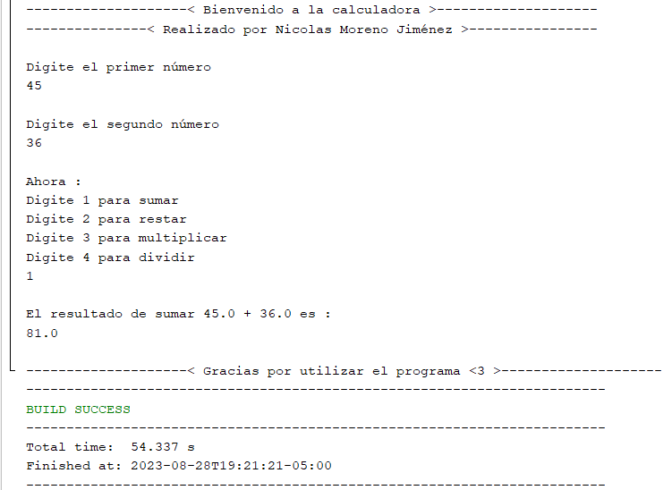
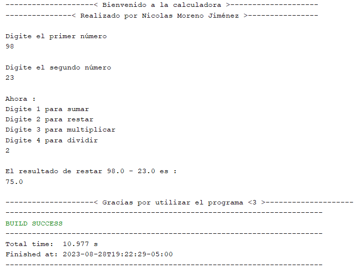
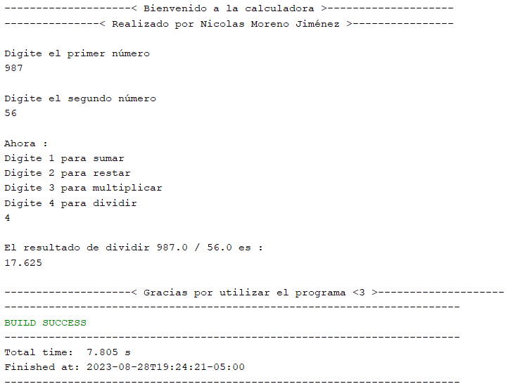

Descripcion
===========
Este es el resultado del código

==================================================

Suma

==================================================

Resta

==================================================

Multiplicación

==================================================

División

